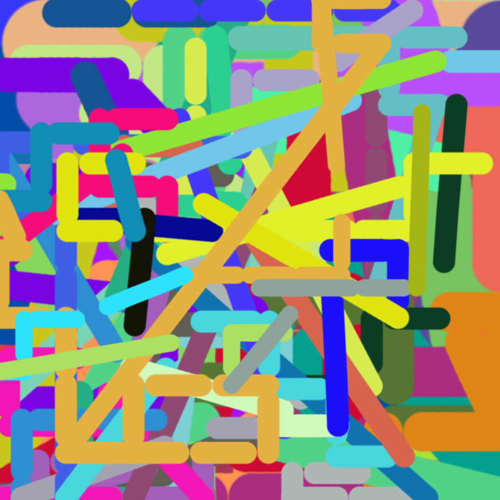

This is code for a friend's art project.

The examples folder contains some images created with this script.

The idea is that first someone would play tetris for a few minutes, with `keylogger.py` running in the background. This saves the player's moves into `keylog.txt`. 

They would then open photoshop and do the following:
- Setup a shortcut so `?` opens the foreground colour picker
- Select brush tool
- Set brush size to 300
- Set smoothing to 0%
- Set brush hardness to 100%
- Make a new blank document

They then run `draw.py` and follow the instructions and wait.

The script will read `keylog.txt` and do something depending on the key:
- **Up Arrow**: Drag up
- **Down Arrow**: Drag down
- **Left Arrow**: Drag left
- **Right Arrow**: Drag right
- **Space**: Change to random colour and move to random position
- **C**: Decrease the brush size and move to random position
